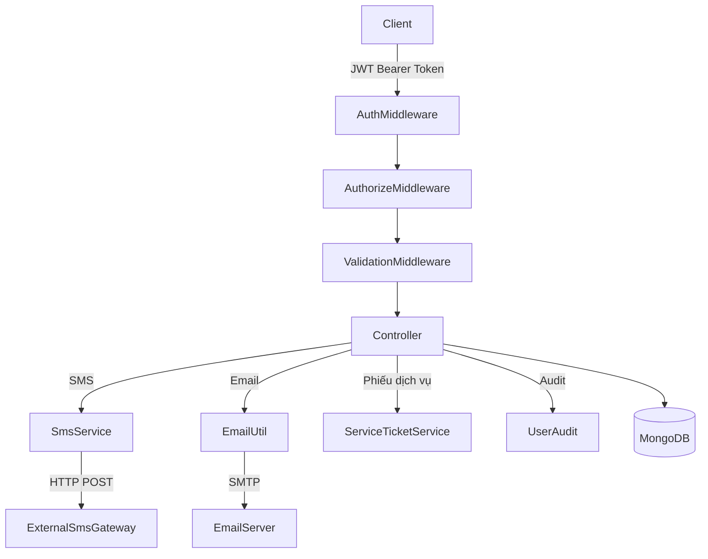

# Tài Liệu Thiết Kế: Admin Appointment Actions

## Tổng Quan

Tính năng **Admin Appointment Actions** bổ sung 6 API endpoint mới vào hệ thống quản lý lịch hẹn sửa xe máy, cho phép admin/quản lý thực hiện các thao tác nâng cao:

| Endpoint | Mô tả |
|---|---|
| `POST /api/admin/appointments/:id/send-sms` | Gửi SMS thông báo cho khách hàng |
| `POST /api/admin/appointments/:id/send-email` | Gửi email thông báo cho khách hàng |
| `GET /api/admin/appointments/:id/service-ticket` | Lấy dữ liệu phiếu dịch vụ |
| `POST /api/admin/appointments/:id/service-ticket/print` | In phiếu dịch vụ (có audit log) |
| `GET /api/admin/appointments/:id/activity-log` | Xem lịch sử hoạt động từ database |
| `PUT /api/admin/appointments/:id/garage-note` | Ghi chú nội bộ của garage |

Tất cả endpoint đều yêu cầu xác thực JWT và role `ADMIN` hoặc `MANAGER`, tuân theo pattern middleware hiện có của dự án.

---

## Kiến Trúc

### Luồng Xử Lý Tổng Quan



### Quyết Định Thiết Kế

**1. `user_id` trong UserAudit là admin hay customer?**

Yêu cầu spec (mục 6.2) ghi `user_id` là `customer_id` của lịch hẹn. Tuy nhiên, toàn bộ codebase hiện tại (ví dụ: `STAFF_ASSIGNED`, `APPOINTMENT_CANCELLED`) dùng `user_id = appointment.customer_id` và lưu `performed_by = req.user.userId` trong `metadata`. Thiết kế này giữ nguyên pattern đó:

- `user_id`: `appointment.customer_id` (chủ sở hữu dữ liệu — để query "tất cả audit của khách hàng X")
- `appointment_id`: field top-level mới (để query "tất cả audit của lịch hẹn Y")
- `metadata.performed_by`: `req.user.userId` (admin/manager thực tế thực hiện)

**2. Audit failure không được làm fail request chính**

Mọi `UserAudit.create(...)` được wrap trong `try/catch` riêng biệt. Nếu lỗi, chỉ `console.error` và tiếp tục trả response.

**3. SMS Service là wrapper HTTP**

`sms.service.js` là thin wrapper gọi HTTP đến SMS Gateway bên ngoài. Controller bắt lỗi từ service và trả HTTP 502.

**4. Activity log query dùng `appointment_id` field top-level**

Thêm field `appointment_id` top-level vào `UserAudit` (thay vì chỉ trong `metadata.appointment_id`) để có index hiệu quả khi query activity log.

---

## Các Thành Phần và Interface

### Thành Phần Mới Cần Tạo

#### `backend/src/services/sms.service.js`

```js
/**
 * @param {{ to: string, message: string }} options
 * @returns {Promise<{ provider_message_id: string, sent_at: Date }>}
 * @throws {Error} nếu SMS Gateway trả về lỗi — controller bắt và trả 502
 */
async function sendSms({ to, message })
```

Đọc cấu hình từ biến môi trường:
- `SMS_GATEWAY_URL` — URL của SMS Gateway
- `SMS_GATEWAY_API_KEY` — API key
- `SMS_GATEWAY_SENDER_NAME` — tên người gửi
- `SMS_GATEWAY_TIMEOUT_MS` — timeout (mặc định 10000ms)

#### `backend/src/services/serviceTicket.service.js`

```js
/**
 * @param {Object} appointment — document Appointment đã được populate đầy đủ
 * @returns {Object} service_ticket object
 */
async function buildServiceTicket(appointment)
```

#### `backend/src/utils/email.util.js` — thêm function

```js
/**
 * @param {string} to — địa chỉ email người nhận
 * @param {string} subject — tiêu đề email
 * @param {string} html — nội dung HTML
 * @returns {Promise<boolean>}
 * @throws {Error} nếu SMTP thất bại
 */
async function sendAppointmentNotification(to, subject, html)
```

### Thành Phần Hiện Tại Cần Sửa Đổi

#### `backend/src/controllers/admin.appointment.controller.js`
Thêm 6 hàm mới:
- `sendSmsNotification`
- `sendEmailNotification`
- `getServiceTicket`
- `printServiceTicket`
- `getActivityLog`
- `updateGarageNote`

#### `backend/src/routes/admin.appointment.routes.js`
Thêm 6 routes mới với validation tương ứng.

#### `backend/src/models/Appointment.model.js`
Thêm field `garage_note`.

#### `backend/src/models/UserAudit.model.js`
- Thêm 4 actions vào enum: `SMS_SENT`, `EMAIL_SENT`, `SERVICE_TICKET_PRINTED`, `GARAGE_NOTE_UPDATED`
- Thêm field top-level `appointment_id`
- Thêm index `{ appointment_id: 1, created_at: -1 }`

---

## Mô Hình Dữ Liệu

### Appointment Model — Thêm Field

```js
garage_note: {
  type: String,
  trim: true,
  default: '',
  maxlength: [1000, 'Garage note must not exceed 1000 characters']
}
```

### UserAudit Model — Thêm Field và Index

```js
// Field mới
appointment_id: {
  type: mongoose.Schema.Types.ObjectId,
  ref: 'Appointment',
  index: true
}

// Thêm vào enum action
'SMS_SENT',
'EMAIL_SENT',
'SERVICE_TICKET_PRINTED',
'GARAGE_NOTE_UPDATED'

// Index mới
userAuditSchema.index({ appointment_id: 1, created_at: -1 });
```

### Service Ticket Object Structure

```js
{
  appointment_code: String,
  status: String,
  appointment_date: String,       // YYYY-MM-DD
  start_time: String,             // HH:MM
  end_time: String,               // HH:MM
  customer: {
    full_name: String,            // từ customer_id populate hoặc customer_snapshot fallback
    email: String,
    phone: String
  },
  vehicle: {
    brand: String,
    model: String,
    license_plate: String,
    odometer: Number
  },
  service: {
    name: String,                 // từ service_id populate hoặc embedded service fallback
    description: String,
    estimated_duration_minutes: Number,
    base_price: Number
  },
  staff: {
    full_name: String,            // từ staff_id populate
    email: String
  },
  repair_bay: {
    name: String,                 // từ repair_bay_id populate
    code: String
  },
  pricing: {
    estimated_price: Number,      // appointment.service.estimated_price
    final_cost: Number            // appointment.final_cost (null nếu chưa hoàn thành)
  },
  notes: {
    staff_notes: String,          // appointment.staff_notes
    garage_note: String           // appointment.garage_note
  },
  generated_at: Date
}
```

### Audit Record Pattern (cho 6 actions mới)

```js
// Pattern chuẩn — áp dụng nhất quán cho tất cả actions
await UserAudit.create({
  user_id: appointment.customer_id,    // chủ sở hữu dữ liệu
  appointment_id: appointment._id,     // field top-level để index
  action: 'ACTION_NAME',
  status: 'SUCCESS',
  metadata: {
    appointment_id: appointment._id,
    customer_id: appointment.customer_id,
    performed_by: req.user.userId       // admin/manager thực hiện
  }
});
```

---

## Xử Lý Lỗi

### Ma Trận Lỗi Theo Endpoint

| Tình huống | HTTP Code | Thông báo |
|---|---|---|
| `:id` không phải MongoDB ObjectId | 400 | `Invalid appointment ID` |
| Appointment không tồn tại | 404 | `Appointment not found` |
| Khách hàng không có số điện thoại | 422 | `Khách hàng chưa có số điện thoại` |
| Khách hàng không có địa chỉ email | 422 | `Khách hàng chưa có địa chỉ email` |
| SMS Gateway lỗi | 502 | `Không thể gửi SMS. Vui lòng thử lại sau` |
| SMTP Email lỗi | 502 | `Không thể gửi email. Vui lòng thử lại sau` |
| `garage_note` vượt 1000 ký tự | 400 | `Garage note must not exceed 1000 characters` |
| Lỗi server | 500 | `Internal server error` |

### Nguyên Tắc Xử Lý Lỗi

1. **Validation lỗi** (400): Bắt sớm bằng `express-validator`, trả trước khi chạm vào business logic
2. **External service lỗi** (502): SMS/Email failure được phân biệt rõ với lỗi hệ thống (500)
3. **Audit failure**: Không bao giờ gây ra lỗi request. Luôn wrap trong `try/catch` riêng:

```js
try {
  await UserAudit.create({ ... });
} catch (auditError) {
  console.error('Audit log failed (non-critical):', auditError);
  // Không throw — tiếp tục trả response thành công
}
```

4. **Phone/Email thiếu** (422): Kiểm tra từ `customer_id` populate trước, fallback sang `customer_snapshot`. 422 Unprocessable Entity phù hợp hơn 400 vì request hợp lệ nhưng business rule không thỏa mãn.

---

## Chiến Lược Kiểm Thử

### Dual Testing Approach

Cả hai loại test đều cần thiết và bổ sung cho nhau:

- **Unit tests**: kiểm tra các ví dụ cụ thể, edge case, và error condition
- **Property-based tests**: kiểm tra các thuộc tính phổ quát trên nhiều input ngẫu nhiên

### Unit Tests

Tập trung vào:
- Tích hợp giữa controller → service → external API (với mock)
- Edge case: phone/email null vs empty string, `garage_note` = `""` (xóa ghi chú)
- Kiểm tra audit record được tạo đúng format

### Property-Based Tests

Sử dụng thư viện `fast-check` (đã tương thích với Jest ecosystem hiện tại).

Cấu hình: tối thiểu 100 iterations mỗi property test.

Tag format: `Feature: admin-appointment-actions, Property {N}: {mô tả}`

Mỗi property-based test PHẢI được implement bởi một test duy nhất tương ứng với property trong tài liệu này.

### Biến Môi Trường Cần Thêm (`.env`)

```
SMS_GATEWAY_URL=
SMS_GATEWAY_API_KEY=
SMS_GATEWAY_SENDER_NAME=
SMS_GATEWAY_TIMEOUT_MS=10000
```


---

## Correctness Properties

*A property is a characteristic or behavior that should hold true across all valid executions of a system — essentially, a formal statement about what the system should do. Properties serve as the bridge between human-readable specifications and machine-verifiable correctness guarantees.*

### Property 1: Nội dung SMS phản ánh đúng thông tin lịch hẹn

*Với bất kỳ* appointment hợp lệ nào có số điện thoại khách hàng, nội dung SMS mặc định được build ra phải chứa `appointment_code`, ngày hẹn (`appointment_date`), và trạng thái (`status`) của lịch hẹn đó. Khi `message` tùy chỉnh được cung cấp, SMS phải dùng đúng nội dung tùy chỉnh đó thay vì nội dung mặc định.

**Validates: Requirements 1.4, 1.5**

### Property 2: Nội dung Email phản ánh đầy đủ thông tin lịch hẹn

*Với bất kỳ* appointment hợp lệ nào có địa chỉ email khách hàng, nội dung HTML email mặc định được build ra phải chứa `appointment_code`, tên khách hàng, thông tin xe, tên dịch vụ, ngày giờ hẹn và trạng thái. Khi `subject` và `message` tùy chỉnh được cung cấp, email phải dùng các giá trị tùy chỉnh đó.

**Validates: Requirements 2.4, 2.5**

### Property 3: Audit record được tạo đúng sau mỗi action thành công

*Với bất kỳ* action thành công nào trong số `SMS_SENT`, `EMAIL_SENT`, `SERVICE_TICKET_PRINTED`, `GARAGE_NOTE_UPDATED` — audit record được tạo ra phải có: `user_id` bằng `customer_id` của lịch hẹn, `appointment_id` bằng `_id` của lịch hẹn, `action` đúng với hành động thực hiện, `status` là `SUCCESS`, `metadata.performed_by` bằng `userId` của admin thực hiện.

**Validates: Requirements 1.6, 2.6, 3.5, 5.5, 6.2**

### Property 4: Service ticket chứa đầy đủ tất cả các trường bắt buộc

*Với bất kỳ* appointment hợp lệ nào, service ticket object được build ra phải chứa đầy đủ các trường: `appointment_code`, `status`, `appointment_date`, `start_time`, `customer` (full_name, email, phone), `vehicle` (brand, model, license_plate), `service` (name), `pricing` (estimated_price), `notes` (staff_notes, garage_note), và `generated_at`. Dữ liệu customer và service phải được lấy từ populated references, với fallback sang embedded snapshot nếu reference không có.

**Validates: Requirements 3.4, 3.5, 3.6**

### Property 5: Activity log được sắp xếp giảm dần theo thời gian tạo

*Với bất kỳ* danh sách activity log nào được trả về từ endpoint `GET /activity-log`, các phần tử trong mảng phải được sắp xếp sao cho `created_at[i] >= created_at[i+1]` với mọi `i`. Mỗi phần tử phải chứa đủ các trường `action`, `status`, `created_at`, `metadata`, và thông tin actor.

**Validates: Requirements 4.4, 4.5**

### Property 6: Limit parameter giới hạn đúng số lượng kết quả activity log

*Với bất kỳ* giá trị `limit` hợp lệ nào trong khoảng [1, 100], số lượng bản ghi trả về trong `activity_log` không được vượt quá giá trị `limit` đó, bất kể có bao nhiêu bản ghi tồn tại trong database.

**Validates: Requirements 4.6**

### Property 7: Cập nhật garage_note không ảnh hưởng đến staff_notes

*Với bất kỳ* appointment nào có giá trị `staff_notes` bất kỳ, sau khi gọi `PUT /garage-note` với `garage_note` hợp lệ bất kỳ, giá trị `staff_notes` của appointment phải giữ nguyên không thay đổi so với trước khi gọi.

**Validates: Requirements 5.4, 5.7**

### Property 8: Validation từ chối garage_note vượt giới hạn ký tự

*Với bất kỳ* chuỗi nào có độ dài lớn hơn 1000 ký tự, request `PUT /garage-note` với chuỗi đó phải bị từ chối với HTTP 400, và document appointment trong database phải không thay đổi.

**Validates: Requirements 5.6**

### Property 9: UserAudit model chấp nhận tất cả action mới

*Với bất kỳ* giá trị nào trong tập `{SMS_SENT, EMAIL_SENT, SERVICE_TICKET_PRINTED, GARAGE_NOTE_UPDATED}`, việc tạo một UserAudit record với action đó phải thành công mà không throw validation error từ Mongoose schema.

**Validates: Requirements 6.1**
